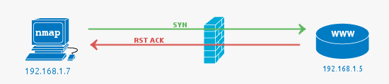

# Enumeration with nmap
Nmap (Network Mapper) is a free and open-source network scanner created by Gordon Lyon. Nmap is used to discover hosts and services on a computer network by sending packets and analyzing the responses. 

### 3 way TCP handshake
During the communication with a TCP service, a single connection is established with the TCP 3 way handshake:
1. The client sends a **SYN** to a TCP open port 
2. If the server sees the **SYN**, it will reply with a **SYN ACK**
3. If the client sees the **SYN ACK**, it replies with an ACK

</img>

In this way, data can be exchanged between the parties. The possible types of port, that *nmap* can detect, are:

Filtered port

A filtered port result from Nmap indicates that the port has not responded at all. The SYN packet has simply been dropped by the firewall.
</img>

Closed port

Closed ports most commonly indicate there is no service running on the port, but the firewall has allowed the connection to go through to the server. It can also mean that no firewall is present at all. 
It is possible to configure a firewall to reject packets rather than drop. This would mean that packets hitting the firewall would be seen as closed (the firewall is responding with RST ACK).
</img>

Open port

Open Ports are usually what you are looking for when kicking off *nmap* scans. The open service could be a publicly accessible service that is, by its nature, supposed to be accessible. It may be a backend service that does not need to be publicly accessible, and therefore should be blocked by a firewall.

### Select a target
To select a target, you can type one of the following commands:

Commands

<table>
  <tr>
    <td>nmap 192.168.1.1</td>
    <td>Scan a single port</td>
  </tr>
  <tr>
    <td>nmap www.example.com</td>
    <td>Scan a host</td>
  </tr>
  <tr>
    <td>nmap 192.168.1.1-20</td>
    <td>Scan a range of IP addresses</td>
  </tr>
  <tr>
    <td>nmap 192.168.1.0/24</td>
    <td>Scan a sub-network</td>
  </tr>
  <tr>
    <td>nmap -iL file.txt</td>
    <td>Scan targets specified in a file</td>
  </tr>
</table>

You can also add other options, that are described in the following sections sections.

Port selection

<table>
  <tr>
    <td>-p 22</td>
    <td>Scan a single port</td>
  </tr>
  <tr>
    <td>-p 1-100</td>
    <td>Scan a range of ports</td>
  </tr>
  <tr>
    <td>-F</td>
    <td>Scan 100 most common ports (FAST)</td>
  </tr>
  <tr>
    <td>-p-</td>
    <td>Scan all 65535 ports.</td>
  </tr>
</table>

Port scan types

<table>
  <tr>
    <td>-sT</td>
    <td>Scan using TCP CONNECT</td>
  </tr>
  <tr>
    <td>-sS</td>
    <td>Scan using TCP SYN SCAN (by default)</td>
  </tr>
  <tr>
    <td>-sU -p 123,161,162</td>
    <td>Scan UDP ports</td>
  </tr>
  <tr>
    <td>-Pn</td>
    <td>Scan selected ports ignoring discovery</td>
  </tr>
</table>

Service and OS detection

<table>
  <tr>
    <td>-A</td>
    <td>Detect OS and services</td>
  </tr>
  <tr>
    <td>-sV</td>
    <td>Standard Service detection</td>
  </tr>
  <tr>
    <td>-sV --version-intensity 5</td>
    <td>More aggressive Service Detection</td>
  </tr>
  <tr>
    <td>-sV --version-intensity 0</td>
    <td>Lighter banner grabbing Detection</td>
  </tr>
</table>

Output formats

<table>
  <tr>
    <td>-oN file.txt</td>
    <td>Save <i>stdout</i> of the command to <i>file.txt</i>.</td>
  </tr>
  <tr>
    <td>-oX file.xml</td>
    <td>Save results as XML.</td>
  </tr>
  <tr>
    <td>-oG file.txt</td>
    <td>Save results with format useful for <i>grep</i>.</td>
  </tr>
  <tr>
    <td>-oA file</td>
    <td>Save results in all the formats.</td>
  </tr>  
</table>

NSE scripts

<table>
  <tr>
    <td>-sC</td>
    <td>Scan using DEFAULT SAFE scripts.</td>
  </tr>
  <tr>
    <td>--script-help=name-script</td>
    <td>Get help for a script.</td>
  </tr> 
  <tr>
    <td>--script=name-script.nse</td>
    <td>Scan using a specified NSE script.</td>
  </tr>
  <tr>
    <td>--script=smb*</td>
    <td>Scan using a set of scripts by using regular expressions. (e.g. scripts with name=smb..)</td>
  </tr>
</table>
To know which are the all the available NSE scripts, you can type the following command:
locate nse | grep script

Scan to search for DDoS reflection UDP services

To make a scan for UDP DDoS reflectors (reflection attacks), you can type the following commands for example:
<pre lang="bash"><code>nmap -sU -A -PN -n -pU:19,53,123,161 -script:ì=ntp-monlist, dns=recursion, snmp-sysdescr 192.168.1.0/24</code></pre>

HTTP Service Information

<table>
  <tr>
    <td>--script=http-title</td>
    <td>Gather page titles from HTTP services.</td>
  </tr>
  <tr>
    <td>--script=http-headers</td>
    <td>Gather page headers of web services.</td>
  </tr>
  <tr>
    <td>--script=http-enum</td>
    <td>Gather web applications from known paths.</td>
  </tr>
</table>

Detect Heartbleed SSL Vulnerability

For heartbleed testing, you can use the following nmap option:
<pre lang="bash"><code>--script=ssl-heartbleed</code></pre>

IP address Information

To find information about an IP address, you can use the following command:
<pre lang="bash"><code>--script=ssl-asn-query, whois, ip-geolocation-maxind</code></pre>

