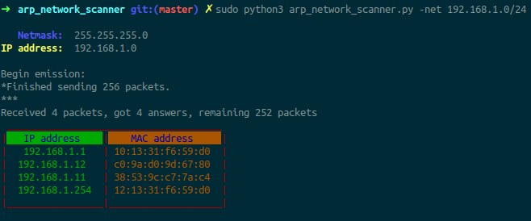

# ARP Network Scanner
To use this network scanner, you need to install scapy module for python3, through this command:
```bash
pip3 install scapy
```
To run the program, you need to type for example this command on bash:
```bash
sudo python3 arp_network_scanner.py -net 192.168.1.0/24 
```
To check which parameters you can insert, you can type the command:
```bash
sudo python3 arp_network_scanner.py --help 
```
An example of output of the command is shown in the following image:

