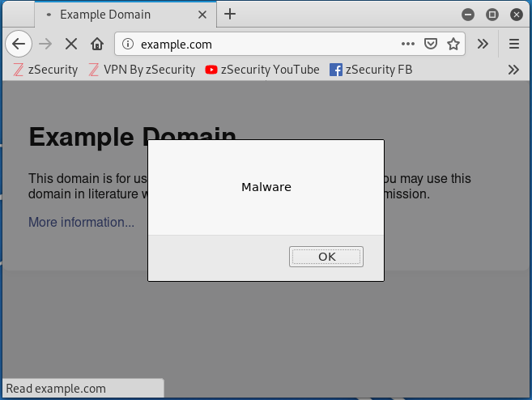

# File Interceptor
This program is going to detect the IP packets interecepted by program. Looking at all the HTTP requests, the program removes HTTP <code>Accept-Encoding</code> header so the response HTML load will not be encrypted. The program inserts the javascript code, taken from a file, in the HTML load of the HTTP response as a script. The addition of the lines of code are performed by replacing <code></body></code> with <code></body></code> statement. Then the program modifies the <code>Content-Length</code> value w.r.t. performed HTML changes.
To use this Interceptor, you need to install the following modules for python3, through this command:
<pre lang="bash"><code>apt install build-essential python3 libnetfilter-queue-dev</code></pre>
<pre lang="bash"><code>pip3 install termcolor argparse</code></pre>
To run the program, you need to type for example this command on bash:
<pre lang="bash"><code>python3 code_interceptor.py -local -f code.js</code></pre>
This command will perform the javascript command in <i>code.js</i>, that in the following case, displays a dialogue window with message <i>Message</i>: 
 
To check which parameters you can insert, you can type the command:
<pre lang="bash"><code>python3 code_interceptor.py --help </code></pre>
The program must run with superuser privileges and can work only on HTTP web pages.
