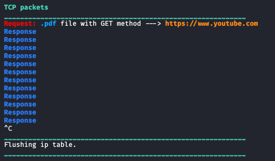

# DNS Spoofing
Response seq = Request ack

This program is going to detect the IP packets sent by user to the server. Then it's going to modify the content of these packets. 
To use this Sniffer, you need to install the following modules for python3, through this command:
<pre lang="bash"><code>apt install build-essential python3 libnetfilter-queue-dev</code></pre>
<pre lang="bash"><code>pip3 install termcolor argparse</code></pre>
To run the program, you need to type for example this command on bash:
<pre lang="bash"><code>python3 dns_spoofing.py</code></pre>
This command will display only the possible POST packets, that are requests with a load. An example of output of the command is shown in the following image: 
 
To check which parameters you can insert, you can type the command:
<pre lang="bash"><code>python3 dns_spoofing.py --help </code></pre>
The program must run with superuser privileges.
