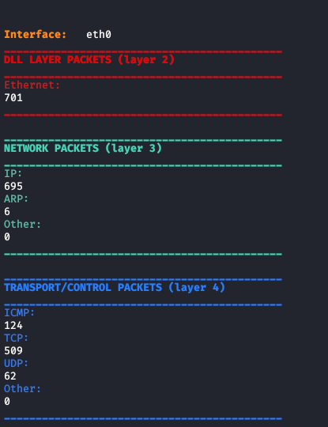

# Packet sniffer
The following programs are two Packet Sniffer impleted using scapy and only socket modules.
By default the machine doesn't work only forwarding the packets and to do it we need to specifiy on the machine that runs this code, the following command on bash:
```bash
echo 1 > /proc/sys/net/ipv4/ip_forward 
```
<details> <summary> <b><i>Packet sniffer using socket module</i></b> </summary> 
The packet sniffer pkt_sniffer.py is implemented using only socket module and looking to Layer 2 primitives.
To use this Packet Sniffer, you need to install the following modules for python3, through this command:
```bash
pip3 install termcolor argparse
```
To run the program, you need to type for example this command on bash:
```bash
sudo python3 pkt_sniffer.py -if eth0
```
This command will display only the number of sniffed packets w.r.t the type of the headers. An example of output of the command is shown in the following image:

If you add the option <i>-verbose</i>, you can obtain a different behaviour of the program:
```bash
sudo python3 pkt_sniffer.py -if eth0 -verbose
```
This command will display all fields of each sniffed packet. An example of output of the command is shown in the following image:

To check which parameters you can insert, you can type the command:
```bash
sudo python3 arp_spoofer.py --help 
```
</details>
<details> <summary> <b><i>Packet sniffer using scapy module</i></b> </summary> 
The packet sniffer scapy_pkt_sniffer.py is implemented using only socket module and looking to Layer 2 primitives.
To use this Packet Sniffer, you need to install the following modules for python3, through this command:
```bash
pip3 install termcolor argparse
```
To run the program, you can type for example this command on bash:
```bash
sudo python3 pkt_sniffer.py -if eth0
```
This command will display only the number of sniffed packets w.r.t the type of the headers. An example of output of the command is shown in the following image:

If you add the option <i>-verbose</i>, you can obtain a different behaviour of the program:
```bash
sudo python3 pkt_sniffer.py -if eth0 -verbose
```
This command will display all fields of each sniffed packet. An example of output of the command is shown in the following image:

To check which parameters you can insert, you can type the command:
```bash
sudo python3 arp_spoofer.py --help 
```
</details>
